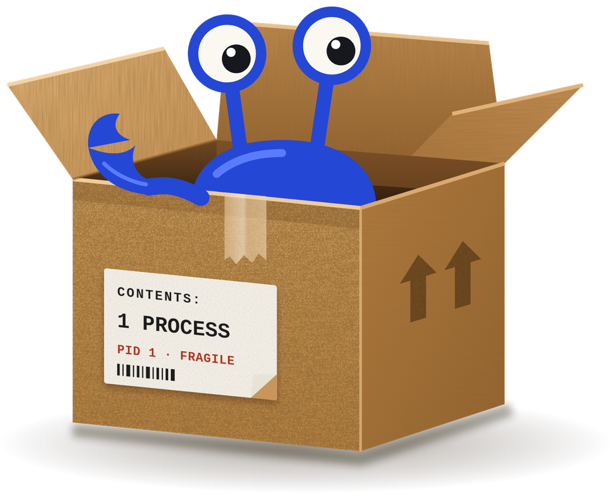
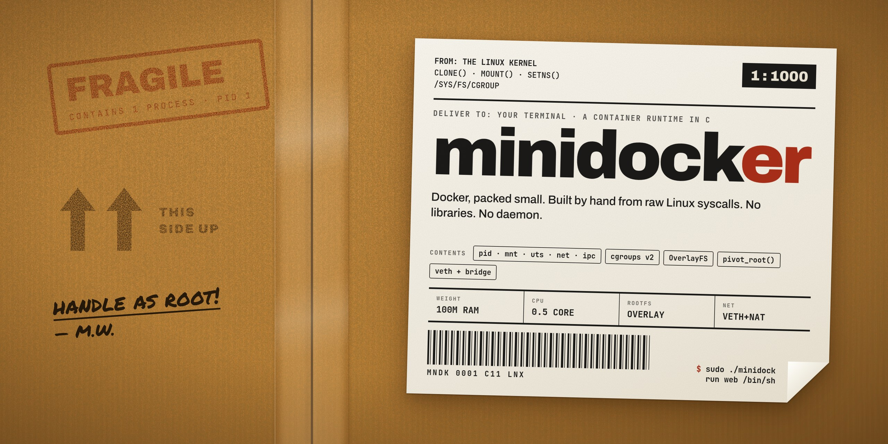

  

  

  
  
  
  
  

  <b>A tiny container runtime, written by hand in C, to understand what Docker actually does.</b> 
  No libraries. No daemon. Just <code>clone()</code>, <code>mount()</code>, <code>pivot_root()</code>, <code>setns()</code> and files under <code>/sys/fs/cgroup</code>.

